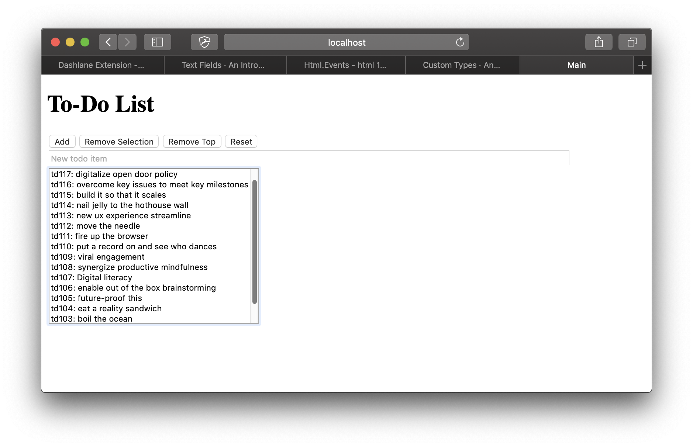
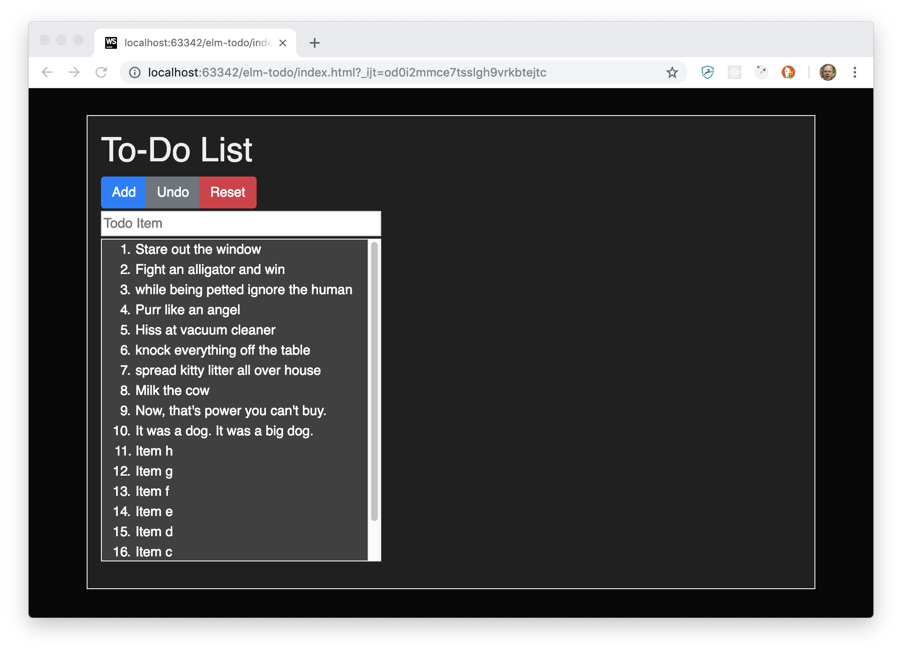

# elm-todo
This is a simple self-contained TODO list implemented in Elm. Being illustrative
of a beginning dip into Elm coding, it has no persistent state.

## Try
+ Click the index.html into your browser-of-choice.  

There is no styling in this initial rendition. It illustrates
the Elm model-update-view cycle implemented as Elm pure functions.  

A screenshot of the the app after turning on 
layout and style via index.html links to Bootstrap 4 CSS and local styles

## Development Environment 

Follow the guidelines at 
[Elm Language Intallation](https://guide.elm-lang.org/install.html)

## References

+ [An Introduction to Elm](https://guide.elm-lang.org/)
+ [Elm Syntax](https://elm-lang.org/docs/syntax#operators) 
