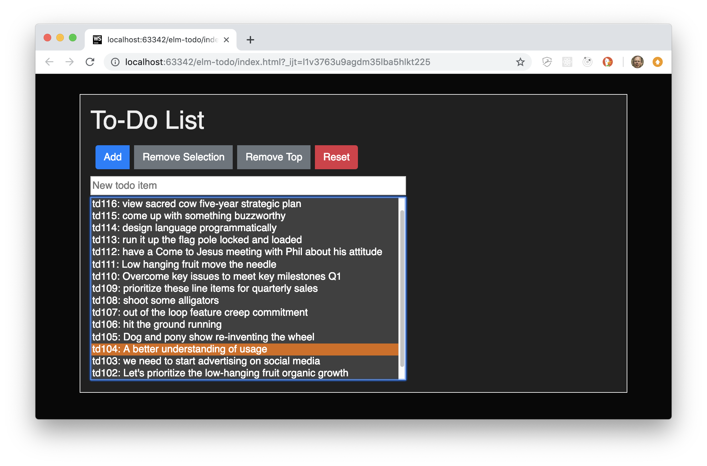

# elm-todo
This is a simple self-contained TODO list implemented in Elm. It uses simple
demo persistance via html 5 localstorage `saveItem` and `loadItem` 

## Try
+ `npm install -g http-serve`
+ Browse to `http://locahost:8080`  

A screenshot of the app given layout and style via index.html links to 
Bootstrap 4 CSS and local styles

## Persistance
Local storage, as used here, is simplistic **demo** persistance. It caches the
todo list via an Elm flag and port coded in JavaScript in an `index.html` 
`<script>` tag. The downside:

+ Each persisted todo collection exists uniquely in each given 
vendor browser per URL. 
+ Separate tabs or windows of a given browser can muddly the shared list. 

Realistic data persistence could implemented via Elm http. 
See [https://guide.elm-lang.org/effects/http.html](https://guide.elm-lang.org/effects/http.html)

## Development Environment 

Follow the guidelines at 
[Elm Language Intallation](https://guide.elm-lang.org/install.html)

## References

+ [An Introduction to Elm](https://guide.elm-lang.org/)
+ [Elm Syntax](https://elm-lang.org/docs/syntax#operators) 
